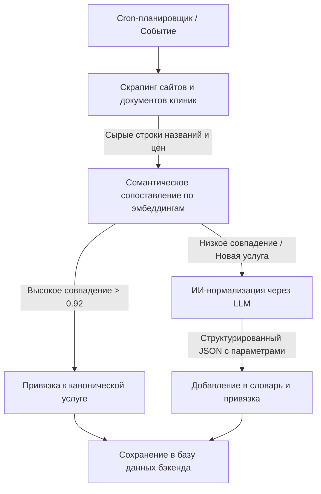

# MedServicePrice — Агрегатор цен на медицинские услуги

Архитектура проекта разделена на четыре автономные части, обеспечивающие масштабируемость, отказоустойчивость и высокую скорость работы.

## Архитектура и Структура проекта

*   **`/web`** — Фронтенд-приложение (Next.js, Tailwind CSS, shadcn/ui, Magic UI). Интуитивно понятный интерфейс, оптимизированный в том числе для пожилых людей.
*   **`/backend`** — Основное API проекта. Быстрая обработка запросов пользователей, полнотекстовый и семантический поиск по каноническому словарю услуг, работа с геопозицией (выбор города) и отслеживанием цен.
*   **`/chat`** — Изолированный микросервис для ИИ-чатбота и диагностики симптомов. Обрабатывает живой диалог с пользователем, анализирует симптомы через LLM и рекомендует врачей/услуги.
*   **`/agent`** — Изолированный фоновый сервис (слой оркестрации). Выполняет тяжелые асинхронные задачи: планирование скрапинга клиник, чтение документов (HTML/Excel/PDF) и ИИ-нормализацию грязных прайсов.

---

## Пайплайн обработки и поиска данных

Для обеспечения высокой скорости поиска ($15\text{–}30$ мс) и экономии токенов LLM, ИИ-нормализация перенесена с этапа реального времени на этап фонового импорта.

### 1. Этап сбора и нормализации (Фон, `/agent`)



*   **Парсинг**: Агент ежедневно скачивает и парсит прайсы клиник.
*   **Гибридный матчинг**: В первую очередь используется векторный поиск по эмбеддингам канонических услуг. Если сходство высокое, привязка происходит автоматически. Если услуга новая или сложная (например, разница в наличии контраста/наркоза), ИИ-агент нормализует параметры через LLM.
*   **Результат**: Чистые структурированные данные с привязкой к единому словарю и выделенными параметрами (наличие контраста, наркоза и т.д.).
*   **Версионирование прайсов**: При сохранении и обновлении цен история изменений записывается в отдельную таблицу (price history) для построения аналитических графиков динамики цен.

### 2. Этап поиска и выдачи (Реалтайм, `/backend` + `/chat`)

*   **Быстрый путь**: Если пользователь вводит точное название (например, *"МРТ"*), бэкенд мгновенно возвращает сгруппированные цены клиник по каноническому ID услуги.
*   **Умный путь (поиск по симптомам)**: Если пользователь вводит симптомы (например, *"болит поясница"*), фронтенд перенаправляет запрос в микросервис **`/chat`**. Чат-бот через LLM переводит симптомы в рекомендации специальностей докторов и услуг (например, *"МРТ поясницы"*), а затем бэкенд возвращает цены на эти услуги.
*   **Геозависимость**: Бэкенд фильтрует результаты по выбранному городу. Если услуга доступна только в других городах, она помечается специальным бейджем.

---

## Запуск проекта

### Фронтенд (`/web`)
```bash
cd web
npm run dev
```
