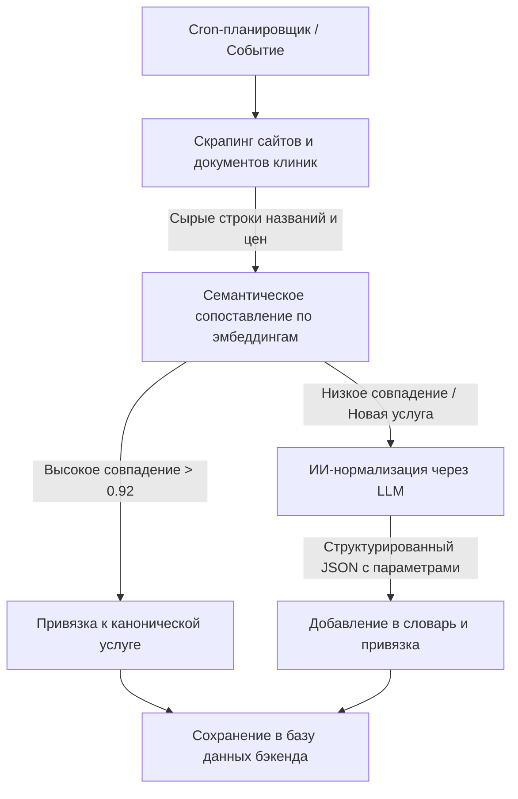

# MedServicePrice — Агрегатор цен на медицинские услуги хех хех хех

Архитектура проекта разделена на четыре автономные части, обеспечивающие масштабируемость, отказоустойчивость и высокую скорость работы.

## Архитектура и Структура проекта

*   **`/web`** — Фронтенд-приложение (Next.js, Tailwind CSS, shadcn/ui, Magic UI). Интуитивно понятный интерфейс, оптимизированный в том числе для пожилых людей.
*   **`/backend`** — Основное API проекта. Быстрая обработка запросов пользователей, полнотекстовый и семантический поиск по каноническому словарю услуг, работа с геопозицией (выбор города) и отслеживанием цен.
*   **`/chat`** — ИИ-Ассистент (интегрирован в `/web/app/api/chat` для запуска в едином процессе). Обрабатывает живой диалог с пользователем, анализирует симптомы через LLM и рекомендует услуги.
*   **`/agent`** — Изолированный фоновый сервис (слой оркестрации). Выполняет тяжелые асинхронные задачи: планирование скрапинга клиник, чтение документов (HTML/Excel/PDF) и ИИ-нормализацию грязных прайсов.

---

## Пайплайн обработки и поиска данных

Для обеспечения высокой скорости поиска ($15\text{–}30$ мс) и экономии токенов LLM, ИИ-нормализация перенесена с этапа реального времени на этап фонового импорта.

### 1. Этап сбора и нормализации (Фон, `/agent`)



*   **Парсинг**: Агент ежедневно скачивает и парсит прайсы клиник.
*   **Гибридный матчинг**: В первую очередь используется векторный поиск по эмбеддингам канонических услуг. Если сходство высокое, привязка происходит автоматически. Если услуга новая или сложная (например, разница в наличии контраста/наркоза), ИИ-агент нормализует параметры через LLM.
*   **Результат**: Чистые структурированные данные с привязкой к единому словарю и выделенными параметрами (наличие контраста, наркоза и т.д.).
*   **Версионирование прайсов**: При сохранении и обновлении цен история изменений записывается в отдельную таблицу (price history) для построения аналитических графиков динамики цен.

### 2. Этап поиска и выдачи (Реалтайм, `/backend` + `/chat`)

*   **Быстрый путь**: Если пользователь вводит точное название (например, *"МРТ"*), бэкенд мгновенно возвращает сгруппированные цены клиник по каноническому ID услуги.
*   **Умный путь (поиск по симптомам)**: Если пользователь вводит симптомы (например, *"болит поясница"*), фронтенд перенаправляет запрос в микросервис **`/chat`**. Чат-бот через LLM переводит симптомы в рекомендации специальностей докторов и услуг (например, *"МРТ поясницы"*), а затем бэкенд возвращает цены на эти услуги.
*   **Геозависимость**: Бэкенд фильтрует результаты по выбранному городу. Если услуга доступна только в других городах, она помечается специальным бейджем.

---

## Быстрый старт с Docker

```bash
# 1. Клонировать репозиторий
git clone <repo-url>
cd last-terricon

# 2. Настроить переменные окружения
cp .env.example .env
# Отредактировать .env (добавить API ключи)

# 3. Запустить все сервисы
docker-compose up -d

# 4. Применить миграции базы данных
docker-compose exec backend alembic upgrade head

# 5. (Опционально) Загрузить тестовые данные
docker-compose exec backend python app/utils/migrate_data.py
```

**Доступные сервисы:**
- Frontend: http://localhost:3000
- Backend API: http://localhost:8000 (docs: http://localhost:8000/docs)
- Flower (Celery monitoring): http://localhost:5555

---

## Запуск без Docker

### Фронтенд (`/web`)
```bash
cd web
npm install
npm run dev
# http://localhost:3000
```

### Backend (`/backend`)
```bash
cd backend
python -m venv venv
source venv/bin/activate
pip install -r requirements.txt
cp .env.example .env
# Настроить .env
./start.sh
# http://localhost:8000
```

### Agent (`/agent`)
```bash
cd agent
python -m venv venv
source venv/bin/activate
pip install -r requirements.txt
cp .env.example .env
# Настроить .env

# Terminal 1: Worker
./start_worker.sh

# Terminal 2: Beat (scheduler)
./start_beat.sh

# Terminal 3: Flower (monitoring)
celery -A app.main flower
# http://localhost:5555
```

---

## Требования

- **Docker & Docker Compose** (рекомендуется)
- Или локально:
  - Python 3.11+
  - Node.js 18+
  - PostgreSQL 14+ с расширением pgvector
  - Redis 7+

---

## Архитектура

```
┌─────────────┐      ┌──────────────┐      ┌─────────────┐
│   Web UI    │─────▶│   Backend    │─────▶│  PostgreSQL │
│  (Next.js)  │      │   (FastAPI)  │      │  + pgvector │
└─────────────┘      └──────────────┘      └─────────────┘
       │                     │                     ▲
       │                     │                     │
       │                     ▼                     │
       │              ┌──────────────┐            │
       │              │    Redis     │            │
       │              │   (Cache)    │            │
       │              └──────────────┘            │
       │                     ▲                     │
       │                     │                     │
       ▼                     │                     │
┌─────────────┐      ┌──────────────┐            │
│  AI Chat    │      │    Agent     │────────────┘
│  (Gemini)   │      │   (Celery)   │
└─────────────┘      └──────────────┘
                            │
                     ┌──────┴──────┐
                     │             │
              ┌──────▼────┐ ┌─────▼──────┐
              │  Scraper  │ │ Normalizer │
              │   Tasks   │ │   (LLM)    │
              └───────────┘ └────────────┘
```

---

## Статус реализации

✅ **Завершено:**
- Frontend (Next.js) с AI чатом, картами, поиском
- Backend API (FastAPI) с семантическим поиском
- Agent service (Celery) со скрапингом и нормализацией
- Database schema с pgvector
- Price history tracking
- Docker configuration

🔄 **В разработке:**
- Расширение парсеров для большего числа клиник
- Улучшение LLM prompts для нормализации
- Мониторинг и алертинг

---

## Лицензия

MIT
